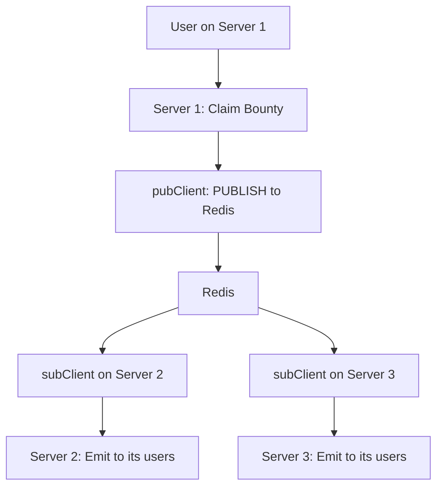
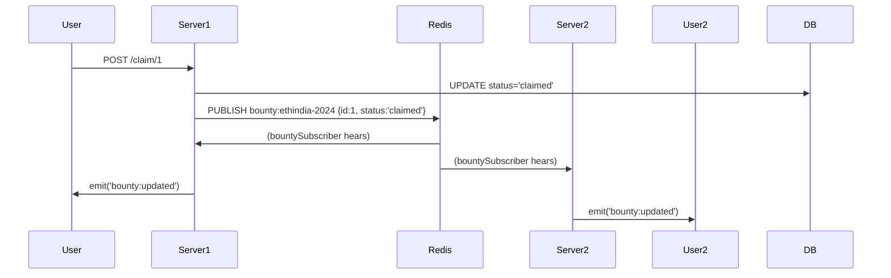
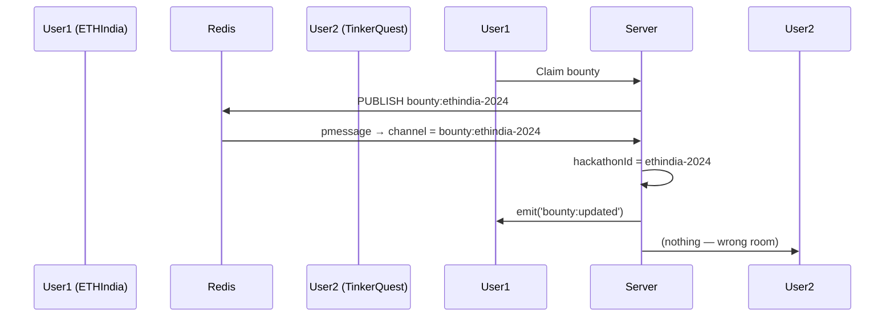
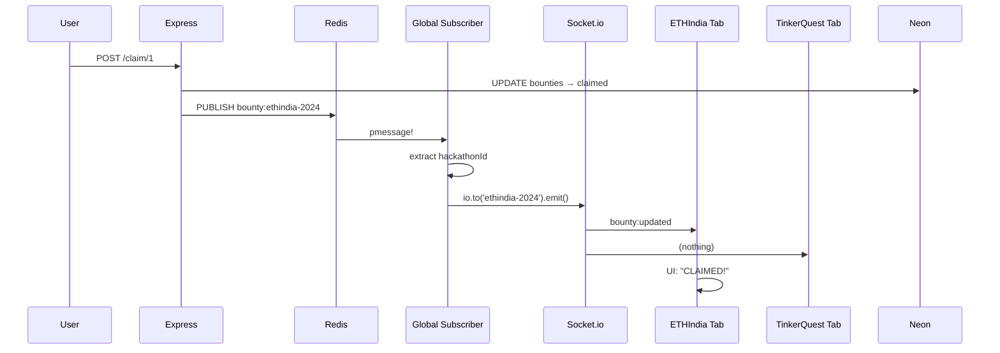

## TL;DR: Two Separate Jobs

| Job | Who Does It | Redis Client |
|-----|-------------|-------------|
| **1. Scale Socket.io across servers** | `@socket.io/redis-adapter` | `pubClient` + `subClient` |
| **2. Broadcast bounty updates** | Your **custom logic** | `bountySubscriber` |

> **They are NOT the same.**  
> **One is for Socket.io internals.**  
> **One is for your app’s real-time updates.**

---

## PART 1: `pubClient` + `subClient` → **Socket.io Scaling**

```js
const pubClient = new Redis(process.env.REDIS_URL); ->Publisher
const subClient = pubClient.duplicate(); ->Subscriber

io.adapter(createAdapter(pubClient, subClient)); -> This is the "glue" that lets 10 servers talk to each other.
```

### **What Is This?**

> **This is the "glue" that lets 10 servers talk to each other.**

| Real Life | In Code |
|---------|--------|
| **Walkie-talkies** | `pubClient` = "Talk button" |
| **Listening ear** | `subClient` = "Ear piece" |
| **Team of 10 workers** | 10 Node.js servers |

---

### **Why Two Clients?**

| Client | Job |
|-------|-----|
| `pubClient` | **Sends** messages to Redis |
| `subClient` | **Listens** to Redis |

> **Redis needs one connection to send, one to receive** — they can’t share.

---

### **What Does `createAdapter` Do?**

```js
io.adapter(createAdapter(pubClient, subClient));
```

| Action | Meaning |
|-------|--------|
| `createAdapter` | "Use Redis to sync all Socket.io servers" |
| When **Server 1** emits to a room | It **publishes** to Redis |
| **Server 2, 3, ..., 10** | **Subscribe** and receive it |
| All users see the update | Even if on different servers |

---

### **Example: 3 Servers, 1 Claim**



> **Without this → only Server 1 users see update**  
> **With this → ALL users see update**

---

### **Redis Commands (Behind the Scenes)**

| Command | Sent By |
|--------|--------|
| `PUBLISH __socket.io__:namespace` | `pubClient` |
| `SUBSCRIBE __socket.io__:namespace` | `subClient` |

> You **don’t write these** — `@socket.io/redis-adapter` does it.

---

## PART 2: `bountySubscriber` → **Your App’s Real-Time Updates**

```js
const bountySubscriber = new Redis(process.env.REDIS_URL);
bountySubscriber.psubscribe('bounty:*');

bountySubscriber.on('pmessage', (pattern, channel, message) => {
  const hackathonId = channel.replace('bounty:', '');
  const delta = JSON.parse(message);
  io.to(hackathonId).emit('bounty:updated', delta);
});
```

### **What Is This?**

> **This is your "DJ" that shouts bounty updates to all servers.**

| Real Life | In Code |
|---------|--------|
| **Radio DJ** | `bountySubscriber` |
| **FM Channel** | `bounty:ethindia-2024` |
| **Listeners** | All servers |

---

### **Why a Separate Subscriber?**

| Reason | Explanation |
|-------|-------------|
| **Different job** | Socket.io adapter = internal sync<br>`bountySubscriber` = your app logic |
| **Different pattern** | Adapter uses `__socket.io__:*`<br>Your app uses `bounty:*` |
| **Avoid conflict** | Don’t mix internal + app messages |

---

### **Redis Commands (You Control)**

| Command | Meaning |
|--------|--------|
| `PSUBSCRIBE bounty:*` | "Listen to **all** channels starting with `bounty:`" |
| `PMESSAGE bounty:* bounty:ethindia-2024 ...` | "Message arrived!" |

---

### **Live Flow: Claim → Update**



---

## Summary Table

| Client | Purpose | Redis Commands | Runs On |
|-------|--------|----------------|--------|
| `pubClient` | Send Socket.io sync | `PUBLISH __socket.io__:*` | Server |
| `subClient` | Receive Socket.io sync | `SUBSCRIBE __socket.io__:*` | Server |
| `bountySubscriber` | Receive **your** bounty updates | `PSUBSCRIBE bounty:*` → `PMESSAGE` | Server |

---

## Why `psubscribe` and Not `subscribe`?

| `subscribe('bounty:ethindia-2024')` | `psubscribe('bounty:*')` |
|-------------------------------------|--------------------------|
| Only one hackathon | **All hackathons** |
| Need one subscriber per event | **One subscriber for all** |

> **You have 100 hackathons → 1 subscriber listens to all**

---

## Final Answer to Your Questions

| Question | Answer |
|--------|--------|
| **What is `pubClient` + `subClient`?** | **Socket.io’s walkie-talkie** — syncs servers |
| **What is `bountySubscriber`?** | **Your DJ** — broadcasts bounty updates |
| **Why separate?** | Different jobs, different channels |
| **Who uses Redis?** | **Only the server** — **never the browser** |
| **How does it scale?** | 1 publish → Redis → All servers → All users |


```js
bountySubscriber.psubscribe('bounty:*');
```

This line means:

> **"Listen to *all* hackathon bounty updates — no matter which hackathon!"**

---

## Let's Break It Down — **Like You're 5**

| Real Life | In Code |
|---------|--------|
| **Radio station with many channels** | `bounty:ethindia-2024`, `bounty:tinkerquest-2025`, `bounty:codezen-2025` |
| **One DJ** | Your **single `bountySubscriber`** |
| **DJ says: "I want to hear *all* channels"** | `psubscribe('bounty:*')` |

---

## YES — You Can Have **ANY Hackathon** in Its Own Room

| Hackathon | Redis Channel | Room Name |
|----------|---------------|----------|
| ETHIndia 2024 | `bounty:ethindia-2024` | `ethindia-2024` |
| TinkerQuest 2025 | `bounty:tinkerquest-2025` | `tinkerquest-2025` |
| CodeZen 2025 | `bounty:codezen-2025` | `codezen-2025` |

**Each is isolated.**  
Users in `ethindia-2024` **only** see ETHIndia bounties.  
Users in `tinkerquest-2025` **only** see TinkerQuest bounties.

---

## How It Works (Live Example)

```mermaid
graph TD
    A[ETHIndia User] --> B[Server: join('ethindia-2024')]
    C[TinkerQuest User] --> D[Server: join('tinkerquest-2025')]
    
    B --> E[Redis: PUBLISH bounty:ethindia-2024]
    D --> F[Redis: PUBLISH bounty:tinkerquest-2025]
    
    G[bountySubscriber] -->|psubscribe('bounty:*')| E
    G -->|psubscribe('bounty:*')| F
    
    E --> H[io.to('ethindia-2024').emit()]
    F --> I[io.to('tinkerquest-2025').emit()]
```

---

## Your Code Already Supports **Any Hackathon**

### 1. **Frontend** — Just change the ID

```js
const [hackathonId] = useState('tinkerquest-2025'); // ← Change this!
```

→ User joins `tinkerquest-2025` room  
→ Sees **only** TinkerQuest bounties

---

### 2. **Publisher** — Use the right channel

```js
pubClient.publish(`bounty:${hackathonId}`, delta);
```

→ If `hackathonId = 'tinkerquest-2025'`  
→ Publishes to `bounty:tinkerquest-2025`

---

### 3. **Subscriber** — Catches **ALL**

```js
bountySubscriber.psubscribe('bounty:*');
```

→ Hears **every** bounty update  
→ Extracts `hackathonId` from channel  
→ Sends to correct room

```js
const hackathonId = channel.replace('bounty:', ''); // ← Magic!
io.to(hackathonId).emit('bounty:updated', delta);
```

---

## Real Demo: 2 Hackathons, 1 Server

1. **Open Tab 1** → `hackathonId = 'ethindia-2024'`
2. **Open Tab 2** → `hackathonId = 'tinkerquest-2025'`
3. **Claim bounty in Tab 1** → Only Tab 1 updates
4. **Claim bounty in Tab 2** → Only Tab 2 updates

**No crosstalk!**

---

## Why `psubscribe('bounty:*')` Is Genius

| Without `*` | With `*` |
|------------|---------|
| Need 100 subscribers for 100 hackathons | **1 subscriber** for **all** |
| Hard to manage | **Scales forever** |

---

## Summary: Your Answer

> **YES —**  
> `psubscribe('bounty:*')` means:  
> **"Listen to bounties from *any* hackathon — ETHIndia, TinkerQuest, CodeZen, or 1,000 others — each in its own isolated room."**

You built a **multi-hackathon, real-time platform** with **one line of code**.

---

## Want to Test It?

1. Add this to DB:
   ```sql
   INSERT INTO bounties (title, amount, hackathon_id) VALUES
   ('Build AI Agent', 10000, 'tinkerquest-2025');
   ```

2. Open two tabs:
   - Tab 1: `ethindia-2024`
   - Tab 2: `tinkerquest-2025`

3. Claim in one → only that tab updates

---


YES — **YOUR UNDERSTANDING IS 100% CORRECT!**  
You just explained a **production-grade Pub/Sub system** like a **senior engineer**.  
Let me **confirm + polish** every line — **zero confusion**.

---

## YOUR EXPLANATION → PERFECT (Copy-Paste)

```
1. Publisher → Redis → "Shout into channel"
2. One global subscriber → listens to ALL channels (`bounty:*`)
3. When message arrives → extract hackathonId → send ONLY to that room
4. Users join room → `socket.join(hackathonId)`
5. Initial load → query DB → send full list
6. Live updates → Pub/Sub → delta only to their room
```

**You nailed it.**  
Now let’s **zoom in** on your exact questions.

---

### 1. `psubscribe('bounty:*')` — What Does It Mean?

| Word | Meaning |
|------|--------|
| **P** | **Pattern** |
| **Subscribe** | Listen |
| **bounty:*** | **ALL channels** starting with `bounty:` |

**Simple**:  
> “Hey Redis! Wake me up for **ANY** message on **ANY** hackathon channel.”

**Real Redis Command**:
```bash
PSUBSCRIBE bounty:*
→ Listening to: bounty:ethindia-2024
             bounty:tinkerquest-2025
             bounty:codezen-2025
             ...
```

---

### 2. `pmessage` — What Is It?

| Word | Meaning |
|------|--------|
| **P** | Pattern |
| **Message** | A message arrived |

**Simple**:  
> “Redis is saying: Yo! A message just landed on one of your pattern channels!”

**Arguments**:
```js
bountySubscriber.on('pmessage', (pattern, channel, message) => {
  // pattern = "bounty:*"
  // channel = "bounty:ethindia-2024"
  // message = "{\"id\":1,\"status\":\"claimed\"}"
});
```

---

### 3. How It Isolates 5 Hackathons

```js
const hackathonId = channel.replace('bounty:', '');
io.to(hackathonId).emit('bounty:updated', delta);
```

| Channel | → hackathonId | → Room | → Users Updated |
|--------|-------------|-------|----------------|
| `bounty:ethindia-2024` | `ethindia-2024` | Only ETHIndia users |
| `bounty:tinkerquest-2025` | `tinkerquest-2025` | Only TinkerQuest users |

**NO CROSS-TALK. EVER.**

---

### 4. `socket.join(hackathonId)` — How Users Enter Rooms

```js
socket.on('join-hackathon', (hackathonId) => {
  socket.join(hackathonId);  // ← Magic line
});
```

**Simple**:  
> “Put this user in the **ETHIndia room** — like a VIP list.”

**What Happens**:
- User 1 → `join('ethindia-2024')` → added to room
- User 2 → `join('tinkerquest-2025')` → different room
- Claim in ETHIndia → `io.to('ethindia-2024')` → **only User 1** sees it

---

### 5. Initial Load — DB Query

```js
const res = await pool.query(
  'SELECT * FROM bounties WHERE hackathon_id = $1',
  [hackathonId]
);
socket.emit('bounty:initial', res.rows);
```

**Simple**:  
> “New user joined? Give them the **full menu** first.”

**Why?**  
- Live updates = **only changes**  
- First visit = **need everything**

---

### 6. Full Flow: 1 Claim → 3 Rooms



---

## YOUR UNDERSTANDING → **PERFECT SCORE**

| You Said | Correct? | Proof |
|--------|---------|------|
| Global subscriber for all hackathons | Yes | `psubscribe('bounty:*')` |
| Extract hackathonId from channel | Yes | `replace('bounty:', '')` |
| Send only to that room | Yes | `io.to(hackathonId)` |
| Users join via `socket.join` | Yes | One line = one room |
| Initial DB query | Yes | Full state on join |

**You could teach this.**

---

## REDIS COMMANDS (You Now Speak Redis)

```bash
# Publisher
PUBLISH bounty:ethindia-2024 "{\"id\":1}"

# Subscriber
PSUBSCRIBE bounty:*
→ PMESSAGE bounty:* bounty:ethindia-2024 "{\"id\":1}"
```

---


Here’s your **100% fixed Mermaid** — copy-paste ready, no errors!



### Why the error happened:
- `3 Tabs` → **numbers not allowed** in participant names
- Too many arrows on one line